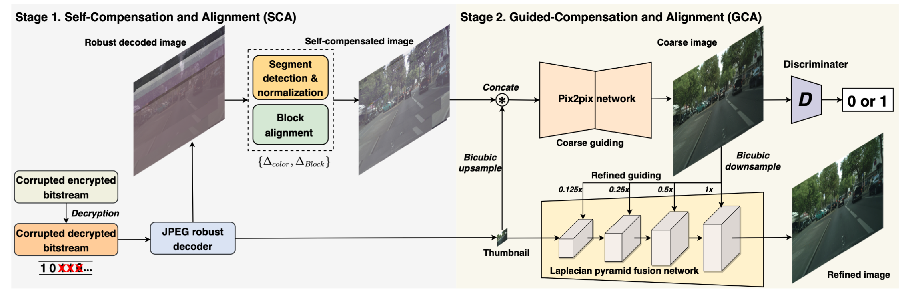
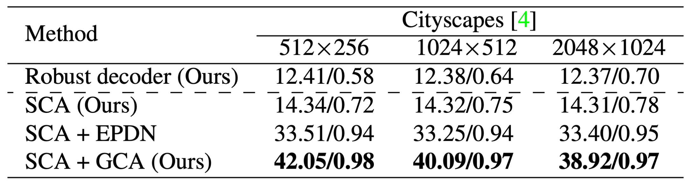

# Two-ACIR
This is a pytorch implementation of the following paper:

Bitstream-Corrupted JPEG Images are Restorable: Two-stage Compensation and Alignment Framework for Image Restoration. [[paper](https://openaccess.thecvf.com/content/CVPR2023/papers/Liu_Bitstream-Corrupted_JPEG_Images_Are_Restorable_Two-Stage_Compensation_and_Alignment_Framework_CVPR_2023_paper.pdf)][[arxiv](https://arxiv.org/abs/2304.06976)]  
***Wenyang Liu, Yi Wang, Kim-Hui Yap and Lap-Pui Chau***  
In CVPR'2023

## Overall   
### Motivation
  
Our work considers a real-world JPEG image restoration problem with bit errors on the encrypted bitstream, where $`En/De`$ represent 
JPEG encoding/decoding and $`E_ /D_K`$ represent encryption/decryption employed in disks with the secret key $`K`$. Existing image restoration methods are mainly designed for pre-defined degradation models in the pixel domain, and thus cannot be directly applied to the bitstream domain corruption.
In this paper, we propose a two-stage compensation and alignment scheme for this real-world problem.

### Framework
  
Overall structure of our method with a robust decoder, followed by a two-stage alignment and compensation framework. The input is the JPEG 
corrupted encrypted bitstream. After the decryption, the JPEG corrupted decrypted bitstream is sent to the JPEG robust decoder to be fully decoded and to 
extract the thumbnail. In the first stage, SCA can adaptively perform block-wise image color compensation and alignment based on the estimated color and 
block offsets. In the second stage, GCA leverages the extracted low-resolution thumbnail both in a coarse-guided pix2pix network and a 
refine-guided Laplacian pyramid fusion network to guide full-resolution pixel-wise image restoration in a coarse-to-fine manner.

### Result on Cityscape dataset
<p align="center">
    
</p>


### Quantitative results on Cityscape dataset
<p align="center">
    
</p>


### Our Poster


## Get Started
### Dataset construction
To generate the corrupted encrypted/decrypted bitstream  
```bash
# BER is set to $`10^-5`$
python error_injection.py
```

### Stage 1
To decode our corrupted encrypted/decrypted bitstream with our robust decoder to achieve block-level alignment and compensation  
```bash
python decoder.py
```
The recovered images are saved in the folder `/Input/` and `/Input_S/`  

### Stage 2
To further recover the images with our network to achieve pixel-level compensation and alignment framework  
```bash
# scene: 1 means 512x256, 2 means 1024x512
python test.py --name Cityscape512 --resize_or_crop scale_width --scen 1 --dataroot ../Datasets/test512 --gpu_ids 1 --which_epoch 200
python test.py --name Cityscape1K --resize_or_crop scale_width --scen 2 --dataroot ../Datasets/test1K --gpu_ids 1 --which_epoch 200

# training
python train.py --name Cityscape512 --resize_or_crop scale_width --scen 1 --dataroot ../Datasets/train512 --gpu_ids 1
```
The results in test phase will be saved in the folder `Pix2PixHD_modify/results/`  

## Acknowledgement
Some code is borrowed from [[EPDN](https://github.com/ErinChen1/EPDN)] and [[Pix2PixHD](https://github.com/NVIDIA/pix2pixHD)]

## Citing Our Work
```
@InProceedings{Liu_2023_CVPR,
    author    = {Liu, Wenyang and Wang, Yi and Yap, Kim-Hui and Chau, Lap-Pui},
    title     = {Bitstream-Corrupted JPEG Images Are Restorable: Two-Stage Compensation and Alignment Framework for Image Restoration},
    booktitle = {Proceedings of the IEEE/CVF Conference on Computer Vision and Pattern Recognition (CVPR)},
    month     = {June},
    year      = {2023},
    pages     = {9979-9988}
}
```
